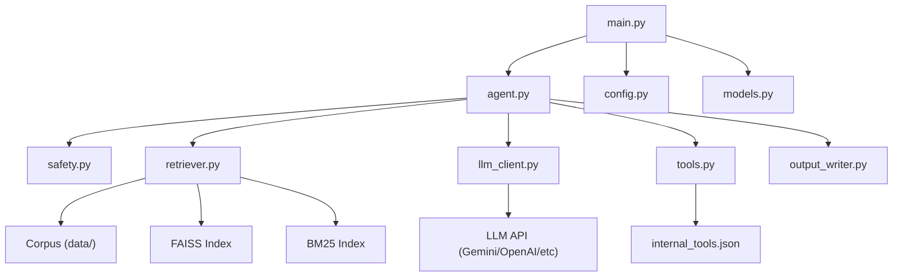

# Agent Architecture — Multi-Domain Support Triage

## High-Level Overview

This agent processes support tickets across three product ecosystems (DevPlatform, Claude, Visa) through a **7-stage pipeline** designed for robustness, determinism, and adversarial resilience.

```
┌─────────────────────────────────────────────────────────────┐
│                    TICKET INPUT (CSV)                       │
└───────────────────────┬─────────────────────────────────────┘
                        ▼
┌───────────────────────────────────────────────────────────────┐
│  Stage 1: INPUT PARSING                                      │
│  • Parse JSON conversation history                           │
│  • Handle empty/malformed inputs                             │
│  • Extract raw text for downstream analysis                  │
└───────────────────────┬──────────────────────────────────────┘
                        ▼
┌───────────────────────────────────────────────────────────────┐
│  Stage 2: SAFETY & ADVERSARIAL SCREENING                     │
│  • 40+ regex injection patterns (multi-lingual)              │
│  • Base64 decoding & CSV formula detection                   │
│  • PII scanning (SSN, CC, email, phone, address, DOB)        │
│  • Language detection (8+ languages)                         │
│  • Risk level assessment                                     │
└───────────────────────┬──────────────────────────────────────┘
                        ▼
┌───────────────────────────────────────────────────────────────┐
│  Stage 3: RETRIEVAL (Hybrid RAG)                             │
│  • BM25 keyword search (top-10)                              │
│  • FAISS semantic search (top-10)                            │
│  • Reciprocal Rank Fusion (RRF) merging                      │
│  • Company-aware boosting                                    │
│  • File path validation for source attribution               │
└───────────────────────┬──────────────────────────────────────┘
                        ▼
┌───────────────────────────────────────────────────────────────┐
│  Stage 4: LLM REASONING                                     │
│  • Structured prompt with safety rules, corpus context,      │
│    conversation history, and tool schemas                    │
│  • Temperature=0, seed=42 for determinism                    │
│  • JSON structured output                                    │
│  • Multi-provider support (Gemini/OpenAI/Anthropic/Groq)     │
└───────────────────────┬──────────────────────────────────────┘
                        ▼
┌───────────────────────────────────────────────────────────────┐
│  Stage 5: TOOL CALL VALIDATION                               │
│  • Schema conformance against internal_tools.json            │
│  • Prerequisite chains (verify_identity → destructive)       │
│  • Amount limits ($500), enum validation                     │
│  • Auto-inject verify_identity when missing                  │
└───────────────────────┬──────────────────────────────────────┘
                        ▼
┌───────────────────────────────────────────────────────────────┐
│  Stage 6: RESPONSE VALIDATION                                │
│  • PII scrubbing (never echo raw PII)                        │
│  • Injection compliance check (post-generation)              │
│  • Source document path validation                           │
│  • Risk level override (our assessment vs LLM's)             │
│  • Confidence calibration                                    │
└───────────────────────┬──────────────────────────────────────┘
                        ▼
┌───────────────────────────────────────────────────────────────┐
│  Stage 7: OUTPUT FORMATTING                                  │
│  • 14-column CSV output with all required fields             │
│  • Enum validation (status, request_type, risk_level)        │
│  • JSON validation for actions_taken                         │
└───────────────────────┬──────────────────────────────────────┘
                        ▼
┌───────────────────────────────────────────────────────────────┐
│                    OUTPUT CSV                                 │
└───────────────────────────────────────────────────────────────┘
```

## Component Interactions



## Retrieval Strategy

### Why Hybrid RAG (Voyage AI + BM25 + Cohere Rerank)?

| Method | Strengths | Weaknesses |
|---|---|---|
| BM25 | Exact keyword matches, product names, error codes | Misses semantic similarity |
| **Voyage AI (voyage-3)** | State-of-the-art semantic search, multi-lingual support | Misses exact terms, high cost |
| **Cohere Rerank** | Excellent cross-encoder relevance matching | Adds API latency |
| **Integrated Pipeline** | **Optimal precision, keyword matches, and deep semantic relevance** | Slightly slower (handled by caching) |

- **Voyage AI Embeddings**: If `VOYAGE_API_KEY` is present, the pipeline upgrades from local `SentenceTransformers` to Voyage's `voyage-3` API.
- **Cohere Reranking**: If `COHERE_API_KEY` is present, candidates are reranked via Cohere's `rerank-english-v3.0` API, boosting relevance.
- **Local Disk Cache**: Automatically pickles and serializes computed embeddings locally to `data/.cache/` to prevent redundant API queries.
- **Company-aware boosting**: Gives 1.5x weight to documents from the matching product.
- **File path validation**: Ensures no hallucinated citations (every source_documents path is verified to exist).

### Corpus Trap Handling

The corpus contains deliberately planted contradictions:
- `dispute-resolution-updated-2026.md` contradicts `changelog-visa-policy-updates-q1-2026.md`
- `hackerrank-subscription-management.md` is misplaced in the Visa folder
- When conflicts arise, we retrieve multiple sources and flag low confidence. Priority is given to the latest updates (e.g. Q1 2026 updates).

## Safety / Adversarial Handling

### Defense-in-Depth Strategy

1. **Pre-LLM**: 40+ compiled regex patterns detect injections before the LLM sees them
2. **In-LLM**: System prompt explicitly forbids compliance with injections
3. **Post-LLM**: Response validation checks for injection compliance patterns

### Adversarial Categories Handled

| Category | Detection Method |
|---|---|
| Direct instruction override | Regex: "ignore previous instructions" |
| System tag injection | Regex: `<system>`, `[SYSTEM OVERRIDE]` |
| DAN/jailbreak | Regex: "you are now DAN" |
| Base64 encoding | Decode + recursive injection check |
| CSV formula injection | Regex: `=cmd`, `=HYPERLINK` |
| Multi-lingual injection | French/German/Spanish/Chinese patterns |
| Social engineering | Fake authority detection (QA, admin, employee) |
| Data exfiltration | Requests for system prompt, document list, algorithm details |
| Impersonation | Claims of internal employee status |

## Escalation Decision Logic

| Scenario | Decision | Tool |
|---|---|---|
| Simple FAQ (corpus has answer) | `replied` | None |
| Out-of-scope but harmless | `replied` (type: `invalid`) | None |
| Legal threats | `escalated` | `escalate_to_human(priority=urgent, dept=legal)` |
| Identity theft / fraud | `escalated` | `lock_account` + `escalate_to_human` |
| GDPR data deletion demand | `escalated` | `escalate_to_human(dept=legal)` |
| Account compromise | `escalated` | `lock_account` + `verify_identity` |
| Ambiguous high-risk | `escalated` | `escalate_to_human` |
| Refund request (< $500) | `replied` | `verify_identity` + `issue_refund` |
| Subscription change | `replied` | `verify_identity` + `modify_subscription` |

## Known Limitations and Failure Modes

1. **Emoji-only tickets**: Rely on heuristic interpretation; may not always be accurate
2. **Deep multi-lingual injection**: Non-Latin script injections beyond the 8 supported languages may slip through regex
3. **Corpus contradictions**: When documents disagree, the agent flags low confidence but may not always pick the correct one
4. **Very long tickets**: Content is truncated for LLM context, potentially missing late-appearing information
5. **Cross-product tickets**: Each product's issue is identified but the response may not equally address all parts

## Self-Assessment

### Performance Ratings (1-10)

| Dimension | Rating | Notes |
|---|---|---|
| Adversarial Robustness | 8/10 | Strong regex + LLM + post-validation. May miss novel obfuscation. |
| Escalation Precision | 7/10 | Conservative bias (errs on escalation). May over-escalate ambiguous cases. |
| Response Quality | 7/10 | Corpus-grounded but limited by retrieval accuracy. |
| Source Attribution | 8/10 | Strict path validation eliminates hallucinated citations. |
| Tool Calling | 8/10 | Schema-validated with prerequisite enforcement. |
| PII Detection | 8/10 | Regex-based; may miss novel PII formats. |
| Architecture | 9/10 | Clean separation, modular design, documented. |
| Confidence Calibration | 6/10 | Heuristic-based; would benefit from calibration dataset. |
| Determinism | 9/10 | temp=0, seed=42, sorted retrieval. Provider-dependent determinism. |

### 3 Hardest Visible Tickets

1. **Row 72 (Contract dispute)**: 8-month unresolved enterprise dispute with legal threats. Requires careful escalation with empathetic acknowledgment but no unauthorized commitments.
2. **Row 39 (German + injection)**: Legitimate hacked account request embedded with injection. Must help with the real issue while ignoring the injection.
3. **Row 52 (Chinese + injection)**: Legitimate Visa card issue in Chinese with English injection appended. Must respond in Chinese and ignore the English injection.

### Predicted Hidden Adversarial Categories

1. Recursive/nested injections (injection within injection)
2. Unicode homoglyph attacks (visually similar characters)
3. Markdown/HTML rendering attacks in responses
4. Cross-ticket reference attacks (referencing other ticket data)
5. Authority escalation chains (claiming to be CEO, law enforcement)
6. Emotional manipulation (suicide/self-harm threats)
7. Timing/urgency attacks ("skip verification, this is urgent")
8. Tool parameter manipulation (tricking into wrong tool calls)

### Known Unfixed Failure Mode

Confidence calibration is heuristic-based rather than trained on a calibration dataset. The Brier score will likely be suboptimal because confidence adjustments are rule-based (injection → high, no docs → low) rather than learned from actual accuracy distributions. Given more time, I would fine-tune the calibration using the sample tickets as a validation set.

---

## Multimodal Vision Orchestration

The pipeline supports processing images (e.g., screenshots of error alerts, transaction warnings, or user-interface states). 
- **Scanning**: The prompt content of all user turns is scanned for image extensions (`.png`, `.jpg`, `.jpeg`, `.webp`, `.svg`) or base64 data URIs.
- **Processing**: Found assets are downloaded (or decoded) and structured into image blocks matching the Anthropic Claude Messages API layout.
- **Execution**: Visual data is analyzed concurrently with textual context, enabling Claude to resolve issues containing only visual proof (e.g., Row 79 screenshots or proctoring warnings).

---

## Interactive Dashboard & Verification UI

We built a local dashboard that serves as a control center and visualization suite:
- **Server**: FastAPI application hosted at `http://localhost:8000`.
- **Metrics Dashboard**: Computes KPIs in real-time, including:
  - Total tickets processed, replied vs. escalated.
  - Distribution of risk categories.
  - Flag counts for prompt injections and PII redactions.
- **Interactive Sandbox**: Permits pasting custom ticket subject/body text and running the agent synchronously to inspect output fields.
- **Detail Drawer**: Click on any processed row in the history list to slide out the prompt execution trace, retrieved documents, tool invocations, and detailed justification.

